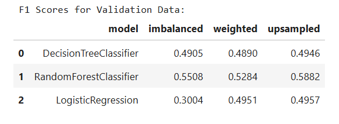
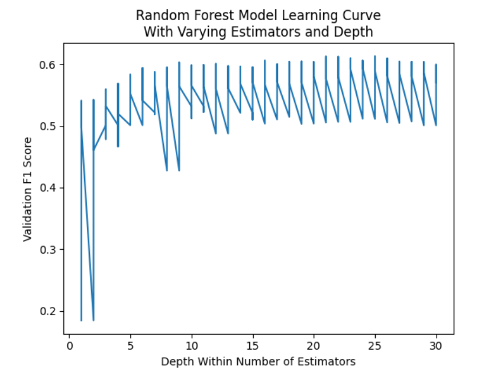

# Sprint 8 Project: Supervised Learning
 
---

### 📚 Table of Contents
- 🔍 [Project Overview](#project-overview)
- 📈 [Conclusion](#conclusion)
- 🖼️ [Sample Outputs](#sample-outputs)
- 📁 [Files](#files)

---

## Project Overview

Beta Bank customers are leaving: little by little, chipping away every month. The bankers figured out it’s cheaper to save the existing customers rather than to attract new ones.

We need to predict whether a customer will leave the bank soon. You have the data on clients’ past behavior and termination of contracts with the bank.

Build a model with the maximum possible F1 score. To pass the project, you need an F1 score of at least 0.59. Check the F1 for the test set.

Additionally, measure the AUC-ROC metric and compare it with the F1.

---

## Conclusion

The purpose of this project was to predict which customers are likely to leave Beta Bank based on demographic and banking data.

After checking the data, changing one data type, and dropping extraneous features and observations with missing values, I encoded and scaled features as appropriate. A fairly severe class imbalance in the target feature Exited (with 80% not exiting) led to poorly perfoming models. Addressing the imbalance by specifying the class_weight parameter and upsampling the data, I found that upsampling produced the best models. Among decision tree, random forest, and logistic regression models, random forest classifiers consistently performed the best. I optimized the number of estimators and max tree depth parameters to obtain an adequate random forest classifier with 25 estimators and a depth of 12. The final model performed well on the test set with an F1 score of 0.61 and AUC-ROC of 0.85, handily outperforming both a sanity check random model and the project F1 threshold of 0.59.

The final model is not extremely strong, but its adequate F1 score ensures that it balances precision and recall to predict bank exits fairly well. It should provide a good basis for identifying customers that might be on the verge of leaving. Beta Bank should reach out and offer enticements to those customers to reduce churn.

---

## Sample Outputs

  
*F1 scores on validation data across three classifiers and three training strategies. The random forest classifier performed best overall, especially after upsampling.*

 

  
*Validation F1 score for the random forest classifier improves with tuning — peaking around 0.6131 at 25 estimators and depth 10.*

---

## Files

📄 See the full analysis in [`sprint-08-project.ipynb`](./sprint-08-project.ipynb)  
📄 Or view a static version in [`sprint-08-project.html`](./sprint-08-project.html)  
📄 Project background: [`project-description.md`](./project-description.md)

> Note: This project uses one CSV file, which is included in the `/data/` folder.  
> See [`/data/README.md`](./data/README.md) for details.
